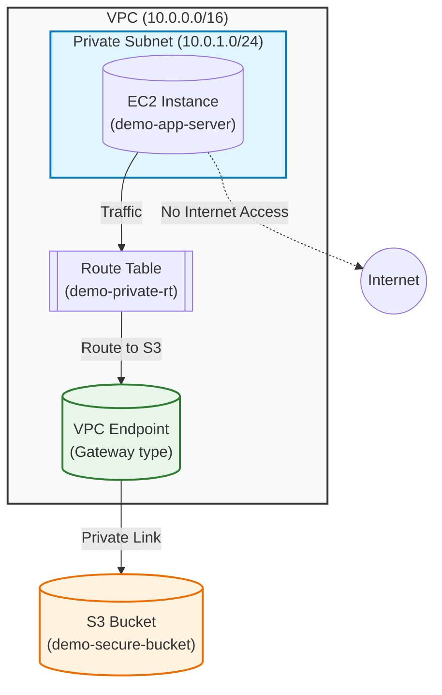

# Terraform S3 VPC Endpoint Demo

這是一個示範專案，展示如何透過 Terraform 在 AWS 建置一個安全的架構：EC2 位於私有子網 (Private Subnet)，透過 VPC Gateway Endpoint 存取 S3 Bucket，完全不經過公開網際網路。

## 架構圖 (Architecture)



## 專案簡介
按照架構圖設計：
1. 位於 VPC(10.0.0.0/16)內, 部署在特定Subnet 中的運算資源(EC2)。
2. EC2 發出對 Subnet 中特定 S3 的存取請求。
3. Subnet 關聯的 Route Table 進行路由判斷。
4. Route Table 中設定了指向 VPC Gateway Endpoint的路由。
5. Endpoint Policy 決定這個 VPC 內的請求可以經由此 Endpoint 存取特定 S3 資源。
6. 請求直接走 AWS 內部網路，抵達對應的 S3 bucket。
7. S3 依據 Bucket Policy 決定是否可存取，如果不是這個 VPC 發出的請求則拒絕存取。

**例外條款**: 因使用 terraform 創立, terraform 位於 VPC 外, 所以從 terraform 來的管理員操作作為例外而許可。

## 事前準備 (Prerequisites)

在開始之前，請確保您已安裝並設定以下工具：

- **Terraform** (>= 1.0)
- **AWS CLI** (並已執行 `aws configure` 完成設定)
- **Session Manager Plugin** (用於透過 AWS CLI 連線至 EC2)

## 變數配置 (Configuration)
本專案使用 `variables.tf` 管理關鍵設定。您可以在執行時透過 `-var` 參數或建立 `terraform.tfvars` 檔案來覆蓋預設值。

| 變數名稱 | 預設值 | 說明 |
| :--- | :--- | :--- |
| `project_name` | "demo" | 專案名稱，將作為資源標籤的前綴 |
| `environment` | "dev" | 環境名稱 (e.g. dev, prod) |
| `region` | "ap-northeast-1" | AWS 部署區域 |

## 檔案功能說明 (File Descriptions)

### 1. `provider.tf` (提供者設定)
- **功能**：設定 Terraform 的 AWS 提供者 (Provider)。
- **內容**：
    - 指定 AWS Provider 的版本 (限制在 version 5.0 以上)。
    - 設定部署的 AWS Region (區域)，引用了 `var.region` 變數。

### 2. `variables.tf` (變數定義)
- **功能**：定義專案中使用的輸入變數，讓程式碼更具彈性與重用性。
- **內容**：
    - `project_name`：專案名稱 (預設為 "demo")，用於資源命名。
    - `environment`：環境名稱 (如 dev, prod)。
    - `region`：AWS 區域 (預設 "ap-northeast-1")。

### 3. `network.tf` (網路基礎建設)
- **功能**：建立核心網路架構以及與 S3 的連接通道。
- **主要資源**：
    - **VPC** (`aws_vpc`)：建立虛擬私有網路。
    - **Subnet** (`aws_subnet`)：建立一個私有子網 (Private Subnet)。
    - **Route Table**：設定路由表，將子網流量導向正確位置。
    - **VPC Gateway Endpoint (S3)** (`aws_vpc_endpoint.s3`)：這是一個關鍵資源。它允許位於私有子網的 EC2 能夠透過 AWS 內部網路直接存取 S3，而不需要經過網際網路 (Internet Gateway)。此外，它還包含了一個 Policy，限制只能存取特定的 Bucket 以及 AWS 必要的 Yum/SSM 套件庫。

### 4. `ec2.tf` (運算資源與權限)
- **功能**：部署應用程式伺服器 (EC2) 並設定相關的安全與權限。
- **主要資源**：
    - **IAM Role & Profile**：建立 EC2 使用的角色，並賦予權限。授予了 S3 存取權 (`AmazonS3FullAccess`) 和 SSM 管理權限 (`AmazonSSMManagedInstanceCore`)。
    - **Security Group (`ec2-sg`)**：設定 EC2 的防火牆規則，只允許對外的 HTTPS (443) 流量 (給 S3 Endpoint 使用)。
    - **EC2 Instance**：實際的虛擬機，使用 Amazon Linux 2 AMI，部署在私有子網中。

### 5. `S3.tf` (儲存資源)
- **功能**：建立物件儲存服務。
- **內容**：
    - 建立一個 **AWS S3 Bucket** (`secure_bucket`)，這是用來測試 Private 存取的目標 Bucket。

### 6. `verify.tf` (驗證與管理通道 - SSM)
- **功能**：建立讓使用者可以「驗證」與「管理」私有主機的基礎建設。
- **原因**：因為 EC2 位於私有子網且沒有 Public IP，一般無法直接 SSH 連入。這個檔案建立的資源是為了讓使用者能使用 AWS Systems Manager (SSM) 的 Session Manager 功能連線進去。
- **主要資源**：
    - **VPC Interface Endpoints**：建立了三個必要的 Endpoint (`ssm`, `ec2messages`, `ssmmessages`)，讓 SSM Agent 能透過私有網路與 AWS SSM 服務溝通。
    - **Security Group (`ssm_sg`)**：允許 VPC 內部流量透過 HTTPS 連線到這些 Endpoint。

### 7. `output.tf` (輸出資訊)
- **功能**：佈署完成後，輸出重要的資源資訊供使用者查看。
- **內容**：
    - S3 Bucket 名稱。
    - EC2 Instance ID。
    - S3 Endpoint ID。

## 使用說明 (Usage)

1. **初始化專案**
   ```bash
   terraform init
   ```

2. **檢視計畫**
   ```bash
   terraform plan
   ```

3. **部署資源**
   ```bash
   terraform apply
   ```

## 驗證步驟 (透過 AWS Console)
部署完成後，請按照以下步驟進行完整的邏輯驗證：

**第一步：登入 EC2**
1. 進入 AWS Console > EC2。
2. 選中名為 `demo-app-server` (或您自訂的 `project_name`) 的實例。
3. 點擊上方 **連線 (Connect)** 按鈕。
4. 切換到 **Session Manager** 頁籤，點擊 **連線 (Connect)**。
   *(如果按鈕反灰，請稍等 1-2 分鐘等待 Agent 註冊)*

**第二步：取得 Bucket 名稱**
在終端機內輸入以下指令，將 Bucket 名稱存為變數：
*(請將這裡替換成您 terraform output 或 console 顯示的 bucket 名稱)*
```bash
export BUCKET_NAME="<your-bucket-name>" 
```

**第三步：執行測試情境**

**測試 A：正向測試（應該成功）**
測試 VPC 內的 EC2 是否能存取指定的 Bucket。
```bash
# 建立一個測試檔案
echo "Hello from VPC" > test.txt

# 上傳檔案 (應該顯示 upload: ... )
aws s3 cp test.txt s3://$BUCKET_NAME/test.txt

# 列出檔案 (應該顯示 test.txt)
aws s3 ls s3://$BUCKET_NAME
```
*預期結果：指令成功執行。這證明了 Route Table 路由正確，且 Endpoint Policy 與 Bucket Policy 均允許存取。*

**測試 B：Endpoint Policy 攔截測試（應該失敗）**
嘗試列出一個公開 Bucket (例如 NOAA 的公開資料集)。
```bash
aws s3 ls s3://noaa-gsod-pds --region ap-northeast-1
```
*預期結果：Access Denied。*
*原因：VPC Endpoint Policy 只允許存取我們指定的 Bucket，其他 S3 存取會被攔截。*

## 資源清理 (Cleanup)
測試完成後，請務必銷毀資源以避免產生額外費用：

```bash
terraform destroy
```
*(注意：S3 Bucket 因為設定了 `force_destroy = true`，其中的檔案也會被一併刪除)*
