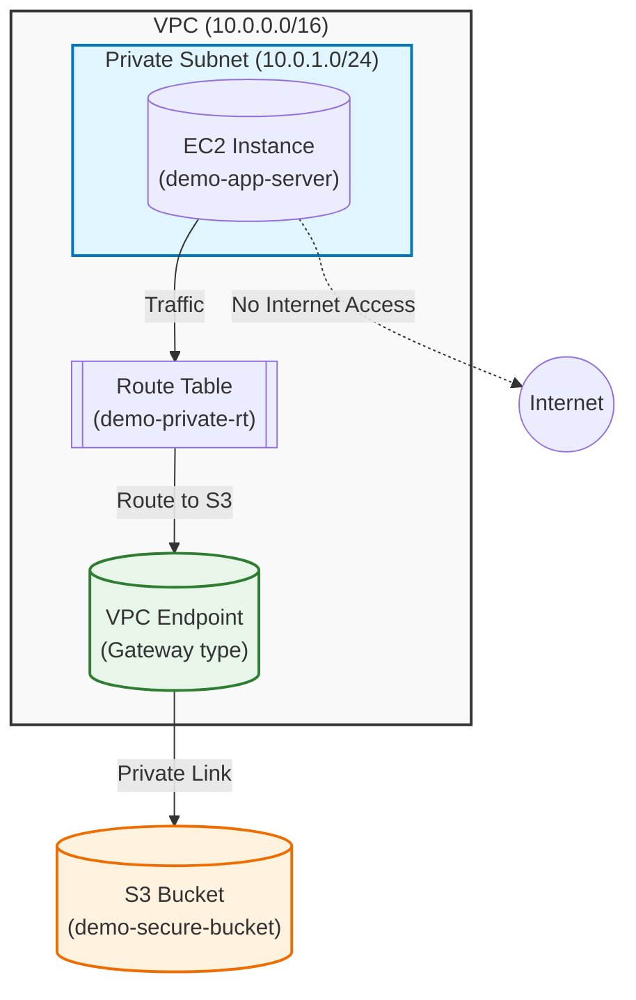

# Terraform S3 VPC Endpoint Demo

這是一個示範專案，展示如何透過 Terraform 在 AWS 建置一個安全的架構：EC2 位於私有子網 (Private Subnet)，透過 VPC Gateway Endpoint 存取 S3 Bucket，完全不經過公開網際網路。

## 架構圖 (Architecture)



## 專案簡介
按照架構圖設計：
1. 位於 VPC(10.0.0.0/16)內, 部署在特定Subnet 中的運算資源(EC2)。
2. EC2 發出對 Subnet 中特定 S3 的存取請求。
3. Subnet 關聯的 Route Table 進行路由判斷。
4. Route Table 中設定了指向 VPC Gateway Endpoint的路由。
5. Endpoint Policy 決定這個 VPC 內的請求可以經由此 Endpoint 存取特定 S3 資源。
6. 請求直接走 AWS 內部網路，抵達對應的 S3 bucket。
7. S3 依據 Bucket Policy 決定是否可存取，如果不是這個 VPC 發出的請求則拒絕存取。

**例外條款**: 因使用 terraform 創立, terraform 位於 VPC 外, 所以從 terraform 來的管理員操作作為例外而許可。

## 事前準備 (Prerequisites)

在開始之前，請確保您已安裝並設定以下工具：

- **Terraform** (>= 1.0)
- **AWS CLI** (並已執行 `aws configure` 完成設定)
- **Session Manager Plugin** (用於透過 AWS CLI 連線至 EC2)

## 變數配置 (Configuration)
本專案使用 `variables.tf` 管理關鍵設定。您可以在執行時透過 `-var` 參數或建立 `terraform.tfvars` 檔案來覆蓋預設值。

| 變數名稱 | 預設值 | 說明 |
| :--- | :--- | :--- |
| `project_name` | "demo" | 專案名稱，將作為資源標籤的前綴 |
| `environment` | "dev" | 環境名稱 (e.g. dev, prod) |
| `region` | "ap-northeast-1" | AWS 部署區域 |

## 專案結構 (Project Structure)
- `provider.tf`: AWS Provider 與 Terraform 版本設定。
- `variables.tf`: 定義專案的可變參數。
- `network.tf`: 定義 VPC, Subnet, Route Table 以及關鍵的 S3 Gateway Endpoint。
- `ec2.tf`: 定義 EC2 Instance, Security Group 以及 IAM Role (包含 SSM 權限)。
- `S3.tf`: 定義私有的 S3 Bucket。
- `verify.tf`: (選用) 用於本地驗證或輔助資源。

## 使用說明 (Usage)

1. **初始化專案**
   ```bash
   terraform init
   ```

2. **檢視計畫**
   ```bash
   terraform plan
   ```

3. **部署資源**
   ```bash
   terraform apply
   ```

## 驗證步驟 (透過 AWS Console)
部署完成後，請按照以下步驟進行完整的邏輯驗證：

**第一步：登入 EC2**
1. 進入 AWS Console > EC2。
2. 選中名為 `demo-app-server` (或您自訂的 `project_name`) 的實例。
3. 點擊上方 **連線 (Connect)** 按鈕。
4. 切換到 **Session Manager** 頁籤，點擊 **連線 (Connect)**。
   *(如果按鈕反灰，請稍等 1-2 分鐘等待 Agent 註冊)*

**第二步：取得 Bucket 名稱**
在終端機內輸入以下指令，將 Bucket 名稱存為變數：
*(請將這裡替換成您 terraform output 或 console 顯示的 bucket 名稱)*
```bash
export BUCKET_NAME="<your-bucket-name>" 
```

**第三步：執行測試情境**

**測試 A：正向測試（應該成功）**
測試 VPC 內的 EC2 是否能存取指定的 Bucket。
```bash
# 建立一個測試檔案
echo "Hello from VPC" > test.txt

# 上傳檔案 (應該顯示 upload: ... )
aws s3 cp test.txt s3://$BUCKET_NAME/test.txt

# 列出檔案 (應該顯示 test.txt)
aws s3 ls s3://$BUCKET_NAME
```
*預期結果：指令成功執行。這證明了 Route Table 路由正確，且 Endpoint Policy 與 Bucket Policy 均允許存取。*

**測試 B：Endpoint Policy 攔截測試（應該失敗）**
嘗試列出一個公開 Bucket (例如 NOAA 的公開資料集)。
```bash
aws s3 ls s3://noaa-gsod-pds --region ap-northeast-1
```
*預期結果：Access Denied。*
*原因：VPC Endpoint Policy 只允許存取我們指定的 Bucket，其他 S3 存取會被攔截。*

## 資源清理 (Cleanup)
測試完成後，請務必銷毀資源以避免產生額外費用：

```bash
terraform destroy
```
*(注意：S3 Bucket 因為設定了 `force_destroy = true`，其中的檔案也會被一併刪除)*
