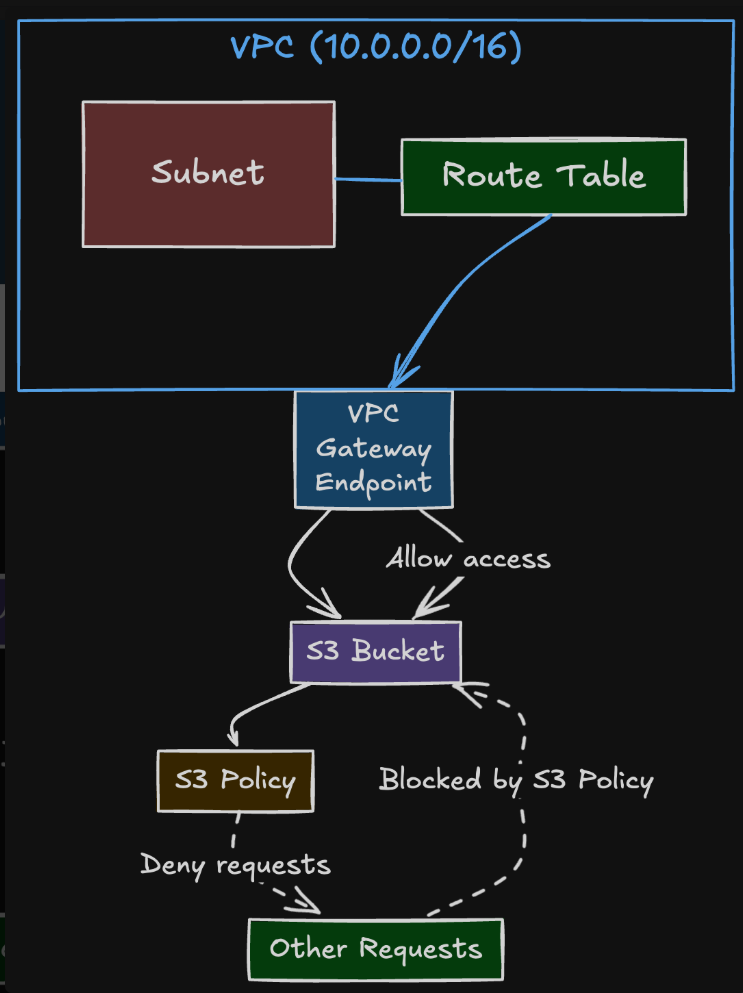

**專案簡介**
按照架構圖設計
位於 VPC(10.0.0.0/16)內, 部署在特定Subnet 中的運算資源(EC2), 發出對 Subnet 中特定 S3的存取請求, 接著Subnet 關聯的 Route Table 進行路由判斷。
Route Table 中設定了指向 VPC Gateway Endpoint的路由 (endpoint policy決定這個 VPC 內的請求 可以經由此 Endpoint 存取特定S3 資源)，
請求直接走 AWS 內部網路，抵達對應的S3 bucket，S3 依據 Bucket Policy決定是否可存取，如果不是這個vpc發出的請求則拒絕存取。
例外條款: 因使用terraform創立, terraform位於VPC外, 所以從terraform來的管理員操作作為例外而許可

**使用說明**
1. 執行terraform init, terraform plan, terraform apply看執行結果
2.
成功條件：在 EC2 內執行 aws s3 ls s3://<your-bucket-name>。
流量路徑：EC2 -> Route Table -> VPC Endpoint -> S3。
結果：成功 (Allow)。

失敗條件 A (Endpoint Policy)：在 EC2 內嘗試存取其他 Bucket (例如 aws s3 ls s3://some-public-bucket)。
結果：Access Denied (因為 Endpoint Policy 只允許存取特定 Bucket)。

失敗案例 B (Bucket Policy)：從您的本機電腦 (非此 VPC) 嘗試存取該 Bucket。
結果：Access Denied (因為 S3 Bucket Policy 拒絕了非來自此VPC的請求)。

**架構圖**

